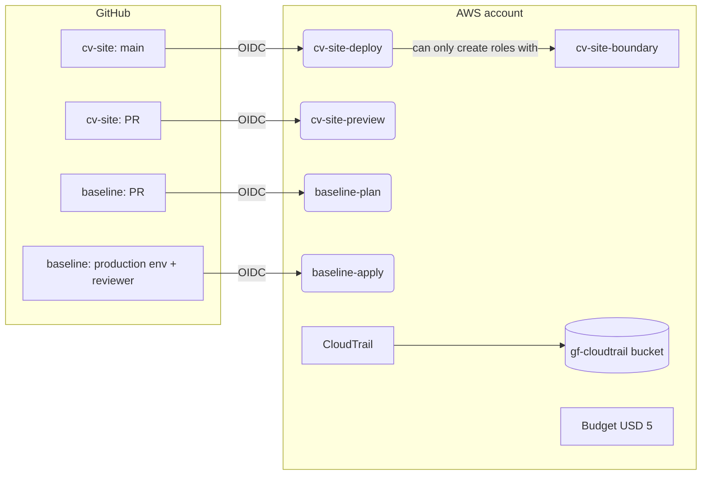

# aws-account-baseline

Terraform that prepares my personal AWS account for [`cv-site`](https://github.com/<owner>/cv-site):
keyless GitHub Actions access through OIDC, least-privilege deploy roles, a cost budget and an audit trail.

The code is CI-tested with **Terraform and OpenTofu**. Every change is linted, security-scanned, unit-tested
with mock providers and planned on the PR, then applied only after manual approval.

## What it creates

| Resource | Purpose |
|---|---|
| GitHub OIDC provider | Lets GitHub Actions assume roles without stored AWS keys |
| `cv-site-deploy` role | `pulumi up` + publish from `cv-site`'s `main` branch only |
| `cv-site-preview` role | Read-only `pulumi preview` on `cv-site` pull requests |
| `cv-site-boundary` policy | Permissions boundary: roles created by the site can only log, read their SSM parameters and send email |
| `baseline-plan` / `baseline-apply` roles | This repo's own CI (plan on PRs; apply only from the protected `production` environment) |
| `monthly-cost` budget | Email alerts at USD 2 forecast / USD 5 actual |
| CloudTrail `baseline-management-events` | Multi-region audit trail with log file validation; log objects expire after 90 days (noncurrent versions deleted 30 days after that) |



## Security model

- **No long-lived credentials.** CI authenticates with OIDC. Every trust policy pins `aud` and the full
  `sub` (repo + branch/PR/environment), and a module validation rejects wildcards.
- **No privilege escalation.** `cv-site-deploy` is built from explicit action lists, not service
  wildcards, wherever resource-level scoping is possible: S3 access is limited to the account's own
  buckets (`aws:ResourceAccount`), SES is limited to identity management (no identity or
  sending-authorization policies), and Lambda invoke permissions can only be granted to API Gateway
  (`lambda:Principal`). The role can only create `cv-site-*` roles that carry the `cv-site-boundary`
  permissions boundary, `iam:PassRole` only to `lambda.amazonaws.com`, and it cannot change the
  boundary, and cannot touch the CI roles (itself and `cv-site-preview`) or any `baseline-*` role.
- **Human-approved applies.** IAM changes to this repo go through a GitHub Environment with a required reviewer.
- **Quiet public logs.** CI prints plan and apply summaries only, so account-specific ARNs do not appear in public logs.

These properties are asserted by `tests/*.tftest.hcl` with allow-list/exact-match assertions (not
just "contains" checks) and were verified with mutation testing: a broadened statement or a dropped
condition makes the corresponding test fail.

### Accepted residual risks

- **`cv-site-deploy` can create and retrust `cv-site-*` roles.** IAM has no condition key that
  constrains the *trust-policy* principal of a role being created (only its permissions can be
  conditioned), so this role could in principle create a `cv-site-*` role trusted by a different,
  less-restricted identity. The blast radius is capped by `cv-site-boundary` on the role's
  permissions, but the real control against a malicious trust policy is branch protection on
  `cv-site`'s `main` branch, since `cv-site-deploy` is itself only assumable from CI running on
  that branch.
- **`baseline-apply` manages `baseline-*` roles, including itself.** This repo's apply role can
  change its own and `baseline-plan`'s IAM. The mitigation is that every apply runs inside the
  `production` GitHub Environment, which requires a human reviewer before it executes.
- **`baseline-apply` is effectively account-admin-equivalent.** It holds bucket-level `s3:*` on
  the CloudTrail bucket and `iam:*` on its own role (see above), so withholding trail-object
  access (below) is defence in depth, not a hard control — the real control on this role is the
  same `production` environment reviewer.
- **`cv-site-preview`'s `lambda:Get*` can read a function's environment variables.** Pulumi's
  Lambda read calls return `Environment.Variables` in full, so anyone who can open a `cv-site`
  pull request can read them. This means secrets must never be passed as Lambda environment
  variables; they must stay in SSM (which `cv-site-preview` cannot read — see below).
- **`baseline-plan` has `iam:Get*`/`iam:List*` on `*`.** Terraform's plan-time refresh reads the
  full IAM state of every resource already in state, and there is no condition key that restricts
  read-only IAM calls to specific resources the way write calls can be restricted. This includes
  `iam:GetAccountAuthorizationDetails` — no secrets are exposed, but it means a full listing of the
  account's IAM roles and policies is readable by anyone who can open a pull request (push a
  branch) against this repo.
- **Workflows must trigger on `pull_request`, never `pull_request_target`.** A pull request can
  edit its own workflow file; `pull_request_target` would run that edited workflow with the
  target-branch's secrets and OIDC trust, letting a PR author escalate. `ci.yml` uses
  `pull_request` throughout, and the `plan` job additionally guards on
  `github.event.pull_request.head.repo.full_name == github.repository` so forked PRs never get
  OIDC credentials.

## Cost

About USD 0/month. IAM, OIDC, the first two budgets and one management-events trail are free. S3 storage costs cents.

## Layout

```
bootstrap/            state bucket (local state, applied once)
modules/secure-bucket private, versioned, TLS-only, SSE-S3 bucket
modules/github-oidc-role  IAM role assumable from one GitHub repo + claims
*.tf                  root module (S3 backend with native locking)
tests/                terraform test with mock providers
```

## Local development

```bash
make check            # fmt, validate, tflint, checkov, tests (Terraform)
make test TF=tofu     # tests with OpenTofu
```

Notes on the toolchain:

- The committed `.terraform.lock.hcl` files are **Terraform's**. OpenTofu resolves providers
  against a different registry address, so running it against a Terraform-locked file would
  rewrite it. `make` avoids that: with `TF=terraform` (the default) it runs
  `init -lockfile=readonly`, which fails on drift against the committed lock file instead of
  silently updating it; with any other `TF` (e.g. `TF=tofu`) it backs up each lock file before
  `init` and restores it afterwards, so the file on disk never changes.
- Regenerate or refresh a lock file only with
  `terraform providers lock -platform=darwin_arm64 -platform=linux_amd64` — never with `tofu`.
- `tflint` is installed from its [GitHub release](https://github.com/terraform-linters/tflint/releases)
  binary, not Homebrew (it's no longer packaged there).

## First-time setup

1. Root user: enable MFA and make sure no root access keys exist.
2. Enable IAM Identity Center (organization instance), create your user with `AdministratorAccess`, then run
   `aws configure sso --profile personal` and `export AWS_PROFILE=personal`.
3. Create the state bucket:
   ```bash
   terraform -chdir=bootstrap init
   terraform -chdir=bootstrap apply
   ```
   Keep `bootstrap/terraform.tfstate` safe (it is git-ignored). If it is lost, re-import the bucket.
4. First apply of the root module:
   ```bash
   export TF_VAR_github_owner=$(gh api user -q .login)
   export TF_VAR_alert_email='you@example.com'
   terraform init -backend-config="bucket=$(terraform -chdir=bootstrap output -raw state_bucket)"
   terraform plan -out=tfplan && terraform apply tfplan
   ```
5. GitHub: this repo is public, so `AWS_ROLE_PLAN`, `AWS_ROLE_APPLY`, `TF_STATE_BUCKET` and
   `ALERT_EMAIL` must all be **secrets**, not variables — GitHub prints `vars` unmasked in `with:`
   inputs and substituted `run:` scripts, and every one of these values is either an ARN
   (which embeds the account ID) or the alert address. Set them with:
   ```bash
   gh secret set AWS_ROLE_PLAN --body "$(terraform output -raw baseline_plan_role_arn)"
   gh secret set AWS_ROLE_APPLY --body "$(terraform output -raw baseline_apply_role_arn)"
   gh secret set TF_STATE_BUCKET --body "$(terraform -chdir=bootstrap output -raw state_bucket)"
   gh secret set ALERT_EMAIL   # prompts for the address, so it never lands in shell history
   ```
   Also create environment `production` with yourself as required reviewer, deployable from
   `main` only.

   Dependabot's version-bump PRs only ever receive Dependabot's own secrets, not the repo's, so
   without this the `plan` job (a required check) would fail on every Dependabot PR. Set the
   three secrets `plan` needs again, scoped to Dependabot. `AWS_ROLE_APPLY` is not needed:
   Dependabot never triggers `apply.yml`.
   ```bash
   gh secret set AWS_ROLE_PLAN --app dependabot --body "$(terraform output -raw baseline_plan_role_arn)"
   gh secret set TF_STATE_BUCKET --app dependabot --body "$(terraform -chdir=bootstrap output -raw state_bucket)"
   gh secret set ALERT_EMAIL --app dependabot   # prompts for the address
   ```
6. Copy `cv_site_deploy_role_arn` and `cv_site_preview_role_arn` into the `cv-site` repo, also as
   **secrets** (same reasoning: both are ARNs embedding the account ID, and `cv-site` is public
   too): `AWS_ROLE_DEPLOY` and `AWS_ROLE_PREVIEW`.

## Day-to-day changes

Open a PR, and CI posts a plan summary. Merge it, approve the `production` deployment, and the apply runs.

## Recovery

- **Locked out of CI** (for example after a broken trust policy): run
  `aws sso login --profile personal` then `terraform apply` locally with the SSO admin profile.
- **Corrupted state**: the state bucket is versioned, so restore the previous version of
  `aws-account-baseline/terraform.tfstate`.
- **Stale lock after a cancelled run**: `use_lockfile` leaves a `.tflock` object behind if a plan
  or apply is killed mid-run. Run `terraform force-unlock <LOCK_ID>` (the ID is printed in the
  error) locally with the SSO admin profile.
